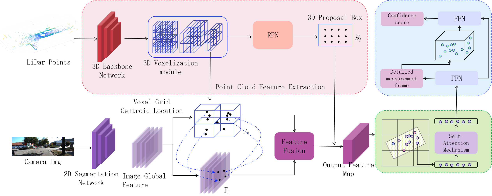

## C2FiPCN: A Coarse-to-Fine Image-Guided 3D Object Detection Point Cloud Generation Network

## It will be improved later...

## Introduction


<table class="center">
    <tr>
    <td width=100% style="border: none"></td>
    </tr>
    <tr>
    <td width="100%" style="border: none; text-align: center; word-wrap: break-word">Overview of our C2FiPCN
</td>
  </tr>

  **Abstract**: Multi-modal 3D object detection, and emphasize the use of virtual point cloud generation technology, point cloud voxelization technology, and coarse-to-fine manner, here is an example:

<table class="center">
    <tr>
    <td width=100% style="border: none"></td>
    </tr>
    <tr>
    <td width="100%" style="border: none; text-align: center; word-wrap: break-word">Pseudo point cloud enhancement
</td>
  </tr>
</table>


## Preparations

**1. Set Environment**

```bash
git clone https://github.com/ZhongkangZ/C2FiPCN
cd C2FiPCN
conda create -n C2FiPCN python==3.7
conda activate C2FiPCN
pip install -r requirements.txt
mkdir repositories
mkdir -p generated_vir/demo_virpoint
mkdir models/vir_point
```
**2. Download Libraries**
```bash
cd repositories
git clone https://github.com/xingyizhou/CenterNet2
git clone https://tianweiy.github.io/mvp
mv vir_point vir_point-ai
cd ..
```
